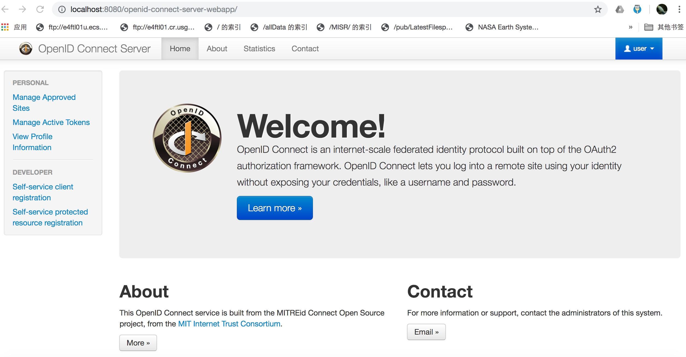

# Hands on

## Reference

* [How To Install Java with `apt` on Ubuntu 18.04](https://www.digitalocean.com/community/tutorials/how-to-install-java-with-apt-on-ubuntu-18-04)
* [Deploy Application at Tomcat Root](https://www.baeldung.com/tomcat-root-application)
* [How To Install and Use Docker on Ubuntu 18.04](https://www.digitalocean.com/community/tutorials/how-to-install-and-use-docker-on-ubuntu-18-04)

## Linux 

Ubuntu 18.04 (bionic) VM
1. Image: [ubuntu-18.04-server-cloudimg-amd64-vagrant.box](https://cloud-images.ubuntu.com/releases/releases/18.04/release/ubuntu-18.04-server-cloudimg-amd64-vagrant.box)
2. Provider: [VirtualBox](https://www.virtualbox.org/wiki/Downloads)
3. Workflow Manager: [Vagrant](https://www.vagrantup.com/downloads.html)

### Vagrant

* Removing outdated image

Optional to fresh vagrant

    fanhonglingdeMacBook-Pro:OpenID-Connect-Java-Spring-Server fanhongling$ vagrant box list
    ubuntu-18.04-server-cloud (virtualbox, 0)
    
    fanhonglingdeMacBook-Pro:OpenID-Connect-Java-Spring-Server fanhongling$ vagrant box remove ubuntu-18.04-server-cloud
    Box 'ubuntu-18.04-server-cloud' (v0) with provider 'virtualbox' appears
    to still be in use by at least one Vagrant environment. Removing
    the box could corrupt the environment. We recommend destroying
    these environments first:

    default (ID: 054871c91ba842908551bcf8fba435e3)

    Are you sure you want to remove this box? [y/N] y
    Removing box 'ubuntu-18.04-server-cloud' (v0) with provider 'virtualbox'...

* Start up from host

for example Mac

    fanhonglingdeMacBook-Pro:OpenID-Connect-Java-Spring-Server fanhongling$ vagrant up

more outputs: [vagrant-command-output.txt](./vagrant-command-output.txt)
  
* Issue

1. Failed while configuring network interfaces

ssh vm

    fanhonglingdeMacBook-Pro:OpenID-Connect-Java-Spring-Server fanhongling$ vagrant ssh
    Welcome to Ubuntu 18.04.3 LTS (GNU/Linux 4.15.0-70-generic x86_64)
    ...
    
init apt-get

    vagrant@ubuntu-bionic:~$ sudo apt-get update
    Get:1 http://security.ubuntu.com/ubuntu bionic-security InRelease [88.7 kB]
    ...
    
-> more outputs: [apt-get-output.txt](./apt-get-output.txt)

install

    vagrant@ubuntu-bionic:~$ sudo apt-get install ifupdown
    ...
    
exit

    vagrant@ubuntu-bionic:~$ exit
    logout
    Connection to 127.0.0.1 closed.

reload from vagrant

    fanhonglingdeMacBook-Pro:OpenID-Connect-Java-Spring-Server fanhongling$ vagrant reload

IP addr the host could access

    vagrant@ubuntu-bionic:~$ ip addr show enp0s8
    3: enp0s8: <BROADCAST,MULTICAST,UP,LOWER_UP> mtu 1500 qdisc fq_codel state UP group default qlen 1000
        link/ether 08:00:27:7f:70:34 brd ff:ff:ff:ff:ff:ff
        inet 172.28.128.3/24 brd 172.28.128.255 scope global enp0s8
           valid_lft forever preferred_lft forever
        inet6 fe80::a00:27ff:fe7f:7034/64 scope link 
           valid_lft forever preferred_lft forever

* Others

1. Using vboxsf

Two host folders are shared with vm

    vagrant@ubuntu-bionic:~$ mount -t vboxsf
    Users_fanhongling_go on /Users/fanhongling/go type vboxsf (rw,nodev,relatime)
    Users_fanhongling_Downloads on /Users/fanhongling/Downloads type vboxsf (rw,nodev,relatime)

mounting path are same as host dir (easy to recognize!)

    fanhonglingdeMacBook-Pro:OpenID-Connect-Java-Spring-Server fanhongling$ ls -d /Users/fanhongling/{go,Downloads}
    /Users/fanhongling/Downloads	/Users/fanhongling/go

saving disk space of vm

    vagrant@ubuntu-bionic:~$ df / -h
    Filesystem      Size  Used Avail Use% Mounted on
    /dev/sda1       9.7G  1.9G  7.8G  20% /

### Java

* OpenJDK

Install

    vagrant@ubuntu-bionic:~$ sudo apt-get install -y default-jdk
    ...
    
Version
    
    vagrant@ubuntu-bionic:~$ java -version
    openjdk version "11.0.4" 2019-07-16
    OpenJDK Runtime Environment (build 11.0.4+11-post-Ubuntu-1ubuntu218.04.3)
    OpenJDK 64-Bit Server VM (build 11.0.4+11-post-Ubuntu-1ubuntu218.04.3, mixed mode, sharing)
    
    vagrant@ubuntu-bionic:~$ javac -version
    javac 11.0.4

* Maven

download tarball from China mainland mirror

    vagrant@ubuntu-bionic:~$ curl -jkSL http://mirrors.tuna.tsinghua.edu.cn/apache/maven/maven-3/3.6.2/binaries/apache-maven-3.6.2-bin.tar.gz -O
      % Total    % Received % Xferd  Average Speed   Time    Time     Time  Current
                                     Dload  Upload   Total   Spent    Left  Speed
    100 8928k  100 8928k    0     0  7515k      0  0:00:01  0:00:01 --:--:-- 7521k

extract into shared folder (saving disk space of vm)

    fanhonglingdeMacBook-Pro:OpenID-Connect-Java-Spring-Server fanhongling$ mkdir -p /Users/fanhongling/Downloads/99-mirror/java-depot
    
    vagrant@ubuntu-bionic:~$ tar --directory=/Users/fanhongling/Downloads/99-mirror/java-depot/ -zxvf apache-maven-3.6.2-bin.tar.gz 
    apache-maven-3.6.2/README.txt
    ...
    
    vagrant@ubuntu-bionic:~$ rm apache-maven-3.6.2-bin.tar.gz 

Add maven bin into PATH env

    vagrant@ubuntu-bionic:~$ ls -l /Users/fanhongling/Downloads/99-mirror/java-depot/apache-maven-3.6.2/bin/mvn
    -rwxr-xr-x 1 vagrant vagrant 5741 Aug 27 15:01 /Users/fanhongling/Downloads/99-mirror/java-depot/apache-maven-3.6.2/bin/mvn

    vagrant@ubuntu-bionic:~$ echo "export PATH=$PATH:/Users/fanhongling/Downloads/99-mirror/java-depot/apache-maven-3.6.2/bin" >maven.rc

    vagrant@ubuntu-bionic:~$ . maven.rc 

    vagrant@ubuntu-bionic:~$ mvn --version
    Apache Maven 3.6.2 (40f52333136460af0dc0d7232c0dc0bcf0d9e117; 2019-08-27T15:06:16Z)
    Maven home: /Users/fanhongling/Downloads/99-mirror/java-depot/apache-maven-3.6.2
    Java version: 11.0.4, vendor: Ubuntu, runtime: /usr/lib/jvm/java-11-openjdk-amd64
    Default locale: en, platform encoding: UTF-8
    OS name: "linux", version: "4.15.0-70-generic", arch: "amd64", family: "unix"

Config (also saving space)

    vagrant@ubuntu-bionic:~$ mkdir .m2
    vagrant@ubuntu-bionic:~$ ln -s /Users/fanhongling/Downloads/99-mirror/java-depot/0x2Em2/repository/ .m2/
    vagrant@ubuntu-bionic:~$ ln -s /Users/fanhongling/Downloads/99-mirror/java-depot/0x2Em2/wrapper/ .m2/
    vagrant@ubuntu-bionic:~$ ls .m2/
    repository  wrapper

this .m2/repository cached all dependencies of earlier maven projects lived in the host and VMs

    vagrant@ubuntu-bionic:~$ du -sh .m2/repository/
    4.2G	.m2/repository/

* Issue

Under openjdk 11, the project is build failed with maven:

    Failed to execute goal ro.isdc.wro4j:wro4j-maven-plugin:1.8.0:run (default) on project openid-connect-server-webapp

Purge

    vagrant@ubuntu-bionic:/Users/fanhongling/Downloads/workspace/src/github.com/tangfeixiong/OpenID-Connect-Java-Spring-Server$ sudo apt-get purge default-jdk default-jdk-headless openjdk-11-jdk openjdk-11-jdk-headless default-jre default-jre-headless openjdk-11-jre openjdk-11-jre-headless

Old version

    vagrant@ubuntu-bionic:/Users/fanhongling/Downloads/workspace/src/github.com/tangfeixiong/OpenID-Connect-Java-Spring-Server$ sudo apt-get install openjdk-8-jdk-headless

    vagrant@ubuntu-bionic:~$ java -version
    openjdk version "1.8.0_222"
    OpenJDK Runtime Environment (build 1.8.0_222-8u222-b10-1ubuntu1~18.04.1-b10)
    OpenJDK 64-Bit Server VM (build 25.222-b10, mixed mode)

    vagrant@ubuntu-bionic:~$ javac -version
    javac 1.8.0_222

## Build

### Maven

1. Mac host

For example

    fanhonglingdeMacBook-Pro:OpenID-Connect-Java-Spring-Server fanhongling$ mvn package

more outputs: [maven-build-output.txt](./maven-build-output.txt)

2. Ubuntu vm

Enter project repo in shared folder

    vagrant@ubuntu-bionic:~$ cd /Users/fanhongling/Downloads/workspace/src/github.com/tangfeixiong/OpenID-Connect-Java-Spring-Server/openid-connect-server-webapp/

Using maven normally

    vagrant@ubuntu-bionic:/Users/fanhongling/Downloads/workspace/src/github.com/tangfeixiong/OpenID-Connect-Java-Spring-Server/openid-connect-server-webapp$ mvn jetty:run-war
    [INFO] Scanning for projects...

### Docker Build

1. Install Docker

Using default Ubuntu repository

    vagrant@ubuntu-bionic:~$ docker
    
    Command 'docker' not found, but can be installed with:
    
    snap install docker     # version 18.09.9, or
    apt  install docker.io
    
    See 'snap info docker' for additional versions.

    vagrant@ubuntu-bionic:~$ sudo apt-get install docker.io

    vagrant@ubuntu-bionic:~$ sudo systemctl --no-pager status docker
    ● docker.service - Docker Application Container Engine
       Loaded: loaded (/lib/systemd/system/docker.service; disabled; vendor preset: enabled)
       Active: active (running) since Mon 2019-11-25 23:37:01 UTC; 3min 19s ago    
    ...

    vagrant@ubuntu-bionic:~$ sudo usermod -aG docker ${USER}

Then exit VM and enter again (vagrant ssh)

Using Docker repository

    vagrant@ubuntu-bionic:~$ sudo apt install apt-transport-https ca-certificates curl software-properties-common

2. Docker images for Maven

Pull

    vagrant@ubuntu-bionic:~$ docker pull openjdk:8u232-jdk
    
    vagrant@ubuntu-bionic:~$ docker pull tomcat:9-jdk8-openjdk-slim    

    vagrant@ubuntu-bionic:~$ docker images
    REPOSITORY          TAG                   IMAGE ID            CREATED             SIZE
    tomcat              9.0-jdk8-openjdk      8957e09b76fa        2 days ago          508MB
    openjdk             8u232-jdk             09df0563bdfc        2 days ago          488MB
    tomcat              9-jdk8-openjdk-slim   593a0e4e93f7        3 days ago          304MB
    openjdk             8-jdk-slim            41fd53971008        3 days ago          284MB

Build Maven with OpenJDK 8

    vagrant@ubuntu-bionic:/Users/fanhongling/Downloads/workspace/src/github.com/tangfeixiong/OpenID-Connect-Java-Spring-Server$ docker build --force-rm --no-cache --rm --tag tangfeixiong/maven:openjdk8-slim -f docker/Dockerfile.maven-openjdk8 ./docker/

validation

    vagrant@ubuntu-bionic:/Users/fanhongling/Downloads/workspace/src/github.com/tangfeixiong/OpenID-Connect-Java-Spring-Server$ docker run -ti --rm --name=temp-openjdk8slim  tangfeixiong/maven:openjdk8-slim "/bin/bash"

asset

    vagrant@ubuntu-bionic:/Users/fanhongling/Downloads/workspace/src/github.com/tangfeixiong/OpenID-Connect-Java-Spring-Server$ docker images tangfeixiong/maven
    REPOSITORY           TAG                 IMAGE ID            CREATED             SIZE
    tangfeixiong/maven   openjdk8-slim       6ac6282246c3        3 minutes ago       300MB

Build with GIT repository

    vagrant@ubuntu-bionic:/Users/fanhongling/Downloads/workspace/src/github.com/tangfeixiong/OpenID-Connect-Java-Spring-Server$ docker build --force-rm --no-cache --rm --tag tangfeixiong/openid-connect:ci -f Dockerfile.git-pull-to-maven-build ./docker/

## Deploy

### Deploy the Server Webapp with Jetty into host (e.g. Mac)

More info to see https://github.com/mitreid-connect/OpenID-Connect-Java-Spring-Server/wiki/Build-instructions

    fanhonglingdeMacBook-Pro:OpenID-Connect-Java-Spring-Server fanhongling$ cd openid-connect-server-webapp/
    fanhonglingdeMacBook-Pro:openid-connect-server-webapp fanhongling$ mvn jetty:run-war

-> outputs [maven-deploy-output.txt](./maven-deploy-output.txt)
-> demo 
